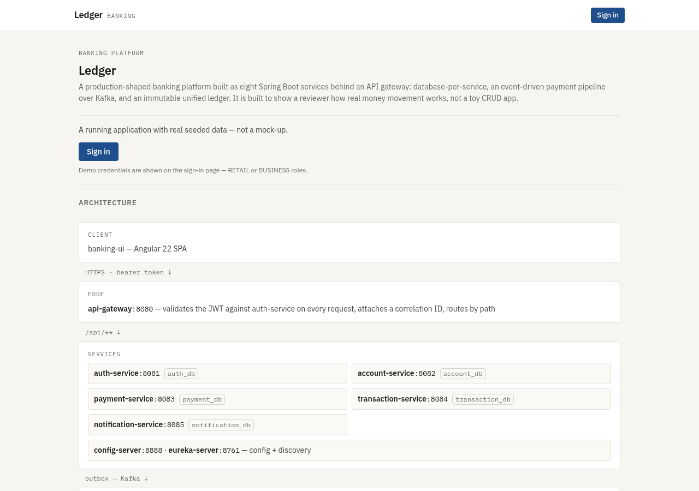
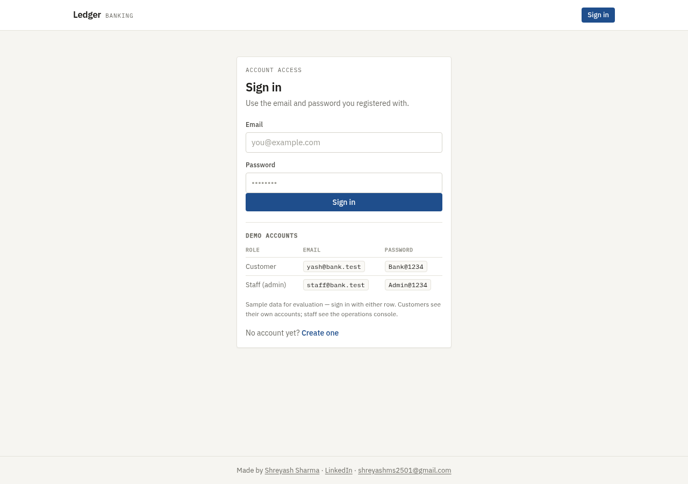
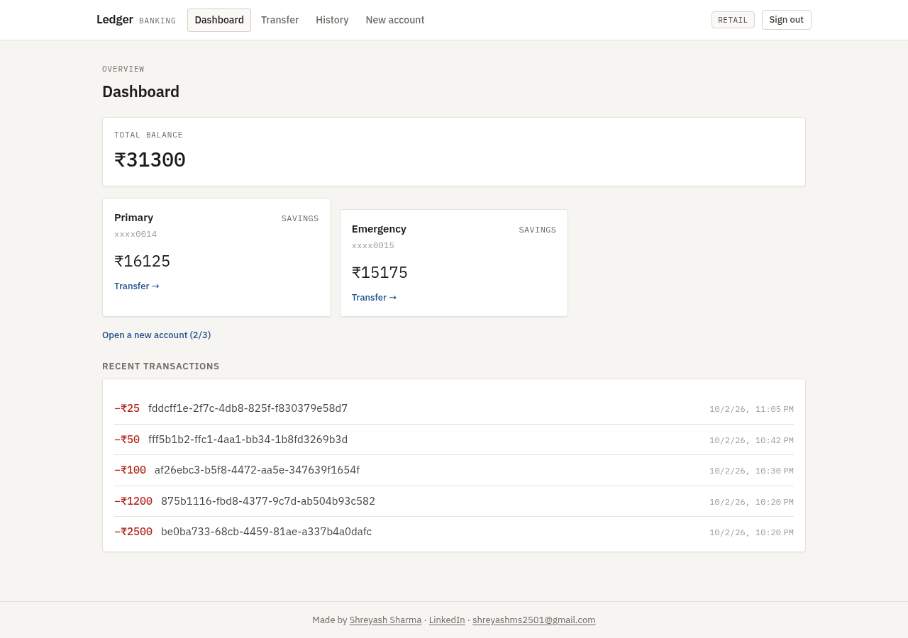
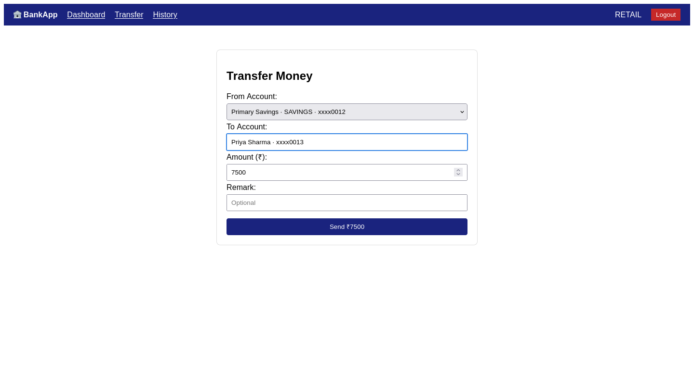
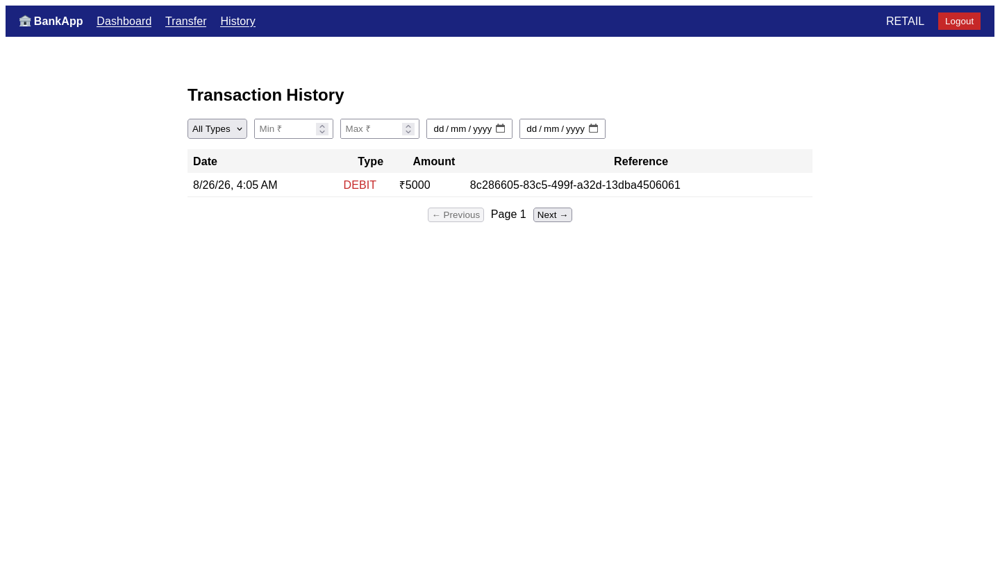

# 🏦 Banking Microservices Platform

**Live demo:** https://lighting-fellowship-gordon-post.trycloudflare.com — sign in with any demo account shown on the sign-in page.

A production-shaped **Java/Spring microservices platform** for a retail + business
bank — accounts, atomic money transfers, an event-driven payment pipeline, an
immutable unified ledger, and role-based access across five services behind an
API gateway.

> **The business problem it solves:** banks don't move money with a single
> `UPDATE` in one database. Real banking platforms are a set of small services
> — one for identities, one for accounts, one for payments, one for the
> immutable ledger, one for notifications — coordinated through an event bus,
> each owning its own data. This project is that architecture, built to be
> understood: every pattern is deliberate, documented, and tested.

---

## What this project shows a reviewer

This is not a toy CRUD app:

- **Database-per-service** — 5 PostgreSQL databases (auth, account, payment,
  transaction, notification), no shared tables, ownership enforced at the
  application layer with logical FKs (see `docs/ONBOARDING.md`).
- **Atomic transfers with race-free overdraft protection** — one ACID
  transaction per transfer using `UPDATE ... WHERE balance >= ?`, so two
  concurrent transfers can never overdraw an account
  (see `docs/ADR.md` → ADR-005).
- **Outbox pattern with a 3-state machine** — `PENDING → SENDING → PUBLISHED`
  ledger entries, batch-synced to the Transaction Service over Kafka, with
  confirmation callbacks and ERROR retry (see ADR-002/003/004). No lost
  entries, no duplicates.
- **Idempotency at every level** — duplicate payment requests rejected,
  `batch_id` prevents double ledger INSERTs, `ON CONFLICT DO NOTHING` makes
  retries safe.
- **Immutable unified ledger** — Transaction Service is append-only, the
  single source of truth for history/reporting, fed by every service that
  moves money.
- **JWT auth with refresh rotation + blacklist** — access tokens (1h), rotated
  refresh tokens (7d, SHA-256 hashed in DB), blacklist-based logout, bcrypt
  password hashing.
- **Role-based access control** — RETAIL / BUSINESS / EMPLOYEE / ADMIN /
  AUDITOR enforced at the gateway and re-checked per-service
  (see `docs/ROLES.md`).
- **Salary → savings lifecycle** — removing an employee from a business
  converts their SALARY accounts to SAVINGS automatically.
- **Distributed tracing** — correlation IDs propagated on every request,
  Zipkin for tracing, structured logs.

## Screenshots (banking-ui, Angular 22)

The Angular client (`banking-ui`) against the live platform — the pre-login front
page, the sign-in screen, the dashboard, a transfer and the ledger history. Its
own repository is
[`banking-ui`](https://github.com/shreyashsharmaprojects-del/banking-ui).

| Welcome (pre-login) | Sign in |
|---|---|
|  |  |

| Dashboard | Transfer | History |
|---|---|---|
|  |  |  |

The sign-in screen prints the demo accounts on the page itself, so a visitor can
use the demo without being told the credentials out of band.

The Dashboard and History views show entries written by transfers that ran
end-to-end through the platform: gateway → payment-service (idempotency +
outbox) → Kafka → transaction-service (immutable ledger), each appearing as a
DEBIT entry. The Transfer screen shows the recipient search resolving a real
account before the form will submit.

## Architecture

```
Client (banking-ui, :4200)
        │
        ▼
┌────────────────┐   JWT validation   ┌─────────────────────┐
│  API Gateway   │───────────────────►│  Config Server      │
│  (:8080)       │  correlation IDs   │  (:8888, native)    │
└───┬─────┬─────┬┘   route by path    └─────────────────────┘
    │     │     │
    ▼     ▼     ▼                      ┌─────────────────────┐
  Auth  Account Payment ──Kafka──►    │  Eureka Registry    │
  8081   8082   8083                   │  (:8761)            │
    │     │     │                      └─────────────────────┘
    │     │     └──ledger-batches──► Transaction (:8084, immutable ledger)
    │     │                          ▲         │
    │     │                          └──ledger-confirm──┐
    │     └─────────── REST ────────────────────────────┤
    │                                                   │
    └─────────── payment-events ──Kafka──► Notification (:8085)
                                          (SMS/email mock, audit trail)
```

| Service | Port | DB | Responsibility |
|---|---|---|---|
| **api-gateway** | 8080 | — | JWT validation, correlation IDs, routing |
| **auth-service** | 8081 | auth_db | Users, roles, JWT issue/refresh/blacklist, admin provisioning |
| **account-service** | 8082 | account_db | Profiles, accounts, atomic transfers, employees, audit log |
| **payment-service** | 8083 | payment_db | Payment orchestration, idempotency, outbox (1s + 10s pollers) |
| **transaction-service** | 8084 | transaction_db | Immutable unified ledger, batch consumer, confirmations |
| **notification-service** | 8085 | notification_db | Kafka-driven alerts, notification history |
| **config-server** | 8888 | — | Centralized config (native profile) |
| **eureka-server** | 8761 | — | Service discovery |

### Kafka topics

| Topic | Producer → Consumer | Purpose |
|---|---|---|
| `payment-events` | Payment → Notification | Per-transfer alert (1s poller) |
| `ledger-batches` | Payment → Transaction | Bulk ledger entries (10s poller) |
| `ledger-confirm` | Transaction → Payment | `COMMITTED` / `FAILED` confirmation |

## Stack

Java 17 · Spring Boot 3.3.2 · Spring Cloud 2023.0.3 · Spring Cloud Gateway ·
Eureka · Config Server · PostgreSQL 16 · Apache Kafka 7.6 · Zipkin · JUnit 5 +
Mockito · Docker Compose

## Quick start

```bash
# 1. Infra: 5× Postgres + Kafka + Zipkin
docker compose up -d

# 2. Core platform (order matters — config first, then discovery, then services)
cd config-server   && mvn spring-boot:run   # :8888
cd eureka-server   && mvn spring-boot:run   # :8761
cd api-gateway     && mvn spring-boot:run   # :8080
cd auth-service    && mvn spring-boot:run   # :8081
cd account-service && mvn spring-boot:run   # :8082
cd payment-service && mvn spring-boot:run   # :8083
cd transaction-service && mvn spring-boot:run  # :8084
cd notification-service && mvn spring-boot:run  # :8085

# 3. Verify
curl localhost:8080/actuator/health          # gateway
curl localhost:8761/                         # eureka dashboard — all services registered
curl localhost:9411/                         # zipkin — trace a transfer end-to-end
```

Schemas auto-apply via `spring.sql.init` (each service ships its own
`schema.sql`). JWT/gateway secrets default to dev-only placeholders and can be
overridden with `JWT_SECRET` / `GATEWAY_SECRET` env vars — **set real values
before any non-local deployment.**

## API surface (via gateway, `/api/**`)

- **Auth:** `POST /api/auth/register` · `/login` · `/refresh` · `/logout` ·
  `/forgot-password` · `/reset-password` · admin provisioning via
  `/api/admin/users`
- **Accounts:** `POST /api/accounts` · `/api/accounts/profile` ·
  `/api/accounts/business-profile` · `POST /api/accounts/transfer` ·
  `POST /api/accounts/{id}/close` · `GET /api/accounts/me` · lookup/search
- **Business:** `POST /api/business/{bizId}/employees` (add/remove, salary
  conversion on remove)
- **Payments:** `POST /api/payments/transfer` (idempotent, outbox-backed)
- **Ledger:** consumed via Kafka; audit trail readable per account
- **Notifications:** history via notification-service API

Full request/response shapes: `docs/FLOWS.md` + per-service `FLOWS.md`.

## Tests

`mvn test` — **76 JUnit 5 + Mockito unit tests, all green** (verified), covering
the money rules:

- **auth-service:** registration validation, duplicate email, login failures,
  refresh rotation, JWT expiry/tamper rejection
- **account-service:** account-type rules, max-accounts, min deposits, label
  uniqueness, atomic transfer (insufficient funds, invalid destination,
  happy path), close rules, ownership 403s, salary→savings conversion
- **payment-service:** idempotent transfer dedup, outbox writes, failure paths
- **transaction-service:** ledger idempotency (no double INSERT), COMMITTED /
  FAILED confirmations
- **notification-service:** Kafka event → notification persistence

## Docs (why every decision was made)

| Doc | Contents |
|---|---|
| `docs/ADR.md` | 10 architecture decision records (outbox, atomic transfer, dual schedulers, correlation IDs…) |
| `docs/ONBOARDING.md` | Retail + business onboarding, ownership model, DB schema |
| `docs/ROLES.md` | Role/permission matrix |
| `docs/FLOWS.md` | 37 flows across services |
| `docs/SCOPE.md` | MVP scope |
| `docs/FUTURE_SCOPE.md` | Roadmap: cards, loans, fraud, K8s, Vault, ELK |
| `docs/BUILD_LOG.md` | Chronological build journal |
| `docs/OPERATIONS.md` | Ops runbook |

## Notes

- MVP decision (ADR-005): no Saga — transfers are atomic in one DB transaction.
  Genuine Saga arrives in Phase 2 (loan disbursement across two databases).
- Email/SMS in Notification Service are **simulated** (console) — the Kafka
  mechanism is real and drops into a real provider integration.
- Frontend (`banking-ui`, Angular) lives in a separate repo.
